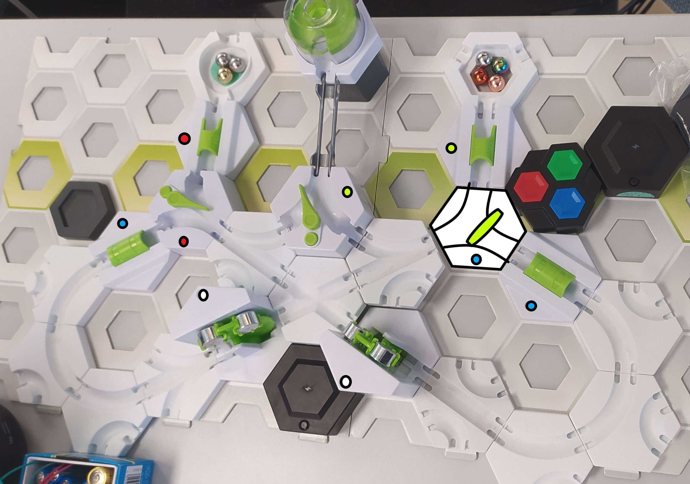

# Gravitrax Reaction game
A small Reaction Game using the gravitrax Python Library. The game generates a sequence of colors. The player needs use Switches to direct the automatically released marbles through the correct Finishes and Triggers.
The Layout needed to play the game is as follows:

# Dependencies
pynput >= 1.7.6  [pypi.org](https://pypi.org/project/pynput/) 
colorama >= 0.4.6 [pypi.org](https://pypi.org/project/colorama/) 
termcolor >= 2.2.0  [pypi.org](https://pypi.org/project/termcolor/) 

[winsound](https://docs.python.org/3/library/winsound.html#module-winsound) is used on Windows Machines to play additional sound effects.

